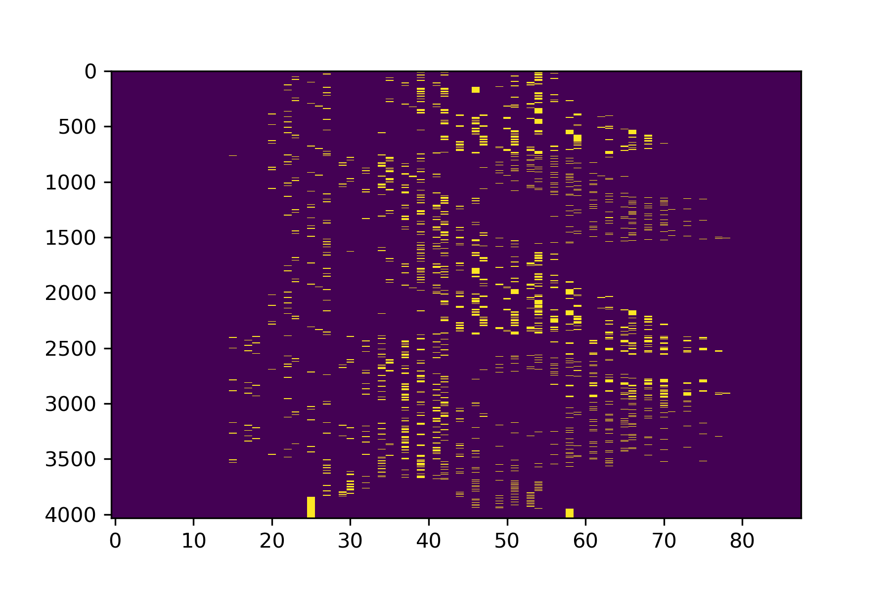
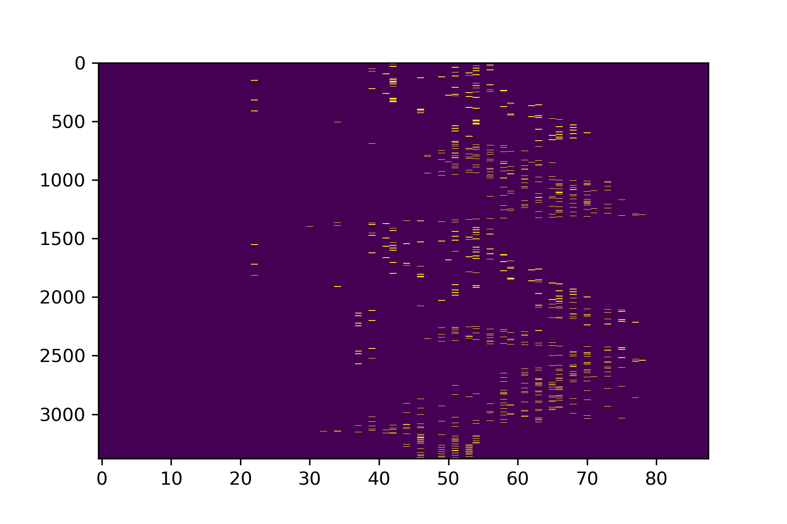
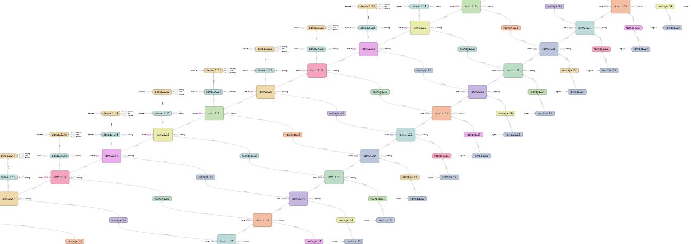

# LSTM-Melody-Generate
LSTM 旋律生成 2019-4-16
### Midi采样
- import parsers
- parser = parsers.MidiParser()
- sequence = parser.parse("midi file path")
##### 可得到如下序列

### 单音旋律提取
- import parsers
- parser = parsers.MidiParser()
- sequence = parser.parse("midi file path")
- parser = parsers.SequenceParser()
- melody = parsers.get_monosyllabic_melody(sequence)
##### 可得到如下单音旋律序列

### 转为one-hot编码
- import parsers
- parser = parsers.MidiParser()
- sequence = parser.parse("midi file path")
- parser = parsers.SequenceParser()
- melody = parsers.get_monosyllabic_melody(sequence)
- matrix = parser.monosyllabic_melody_to_matrix(melody)
### LSTM

### 训练
- 运行train.py
### 预测
- 运行predict.py
